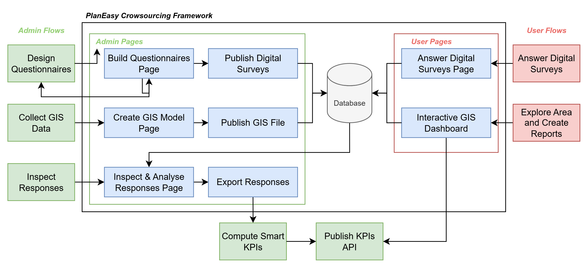

<div align="left">
  <table border="0" cellpadding="0" cellspacing="0" style="border:1px solid transparent;">
    <tr style="border:1px solid transparent;">
      <td style="border:1px solid transparent; vertical-align: middle; padding-right: 16px;">
        
      </td>
      <td style="border:1px solid transparent; vertical-align: middle;">
        <h1 style="margin: 0; padding: 0;">Unified Data Architecture – PlanEasy Crowdsourcing System</h1>
        <p><strong>Interoperable and FAIR Data Model for Participatory Research</strong></p>
      </td>
    </tr>
  </table>
</div>

---
The **PlanEasy Crowdsourcing System** defines a unified and interoperable data structure  
for collecting, storing, and exporting responses from participatory questionnaires and mobility tracking.

This architecture is part of the broader **PlanEasy Framework**, developed to support  
scientific research, participatory mapping, and citizen science applications.  
It is **project-agnostic**, meaning that any initiative (e.g. [*theBIKEnet*](https://github.com/MovingProjects/thebikenet/blob/main/README.md)) can adopt this structure  
for consistent, transparent, and FAIR data management.

Responses can be stored, synchronized, or exported using the same schema  
across **Local**, **Firestore**, and **MongoDB** databases.

> For details on privacy, consent, and GDPR compliance, see  
> [Privacy and Consent Guidelines](PRIVACY_GUIDELINES.md).


---

## 📋 Overview

The PlanEasy Crowdsourcing System supports multiple types of participant data collected through  
web and mobile questionnaires.

| **Dataset** | **Description** | **Collection / Example Path** | **Analysis Type** |
|--------------|-----------------|-------------------------------|-------------------|
| **Survey Responses** | Statistical questionnaires about user profile, habits, perceptions, and attitudes. | `surveyResponses/{questionnaireId}/responses/{timestampId}` | Non-spatial (statistical) |
| **Spatial Reports** | Geo-located questionnaires describing infrastructure, parking, or safety issues. | `spatialReports/{questionnaireId}/responses/{timestampId}` | Spatial (GIS-based) |
| **Trips** | GPS traces and related pre- and post-trip surveys collected via the mobile app. | `trips/{tripId}/locations/{positionId}` | Spatiotemporal (behavioural) |

All datasets share the same principles:

- **Anonymity:** each record is pseudonymized using a SHA-256 hash of the participant’s email (`uid`).
- **Transparency:** all timestamps are stored in **UTC** and accompanied by the user’s **local timezone**.
- **FAIR compliance:** all questionnaire versions are version-controlled on GitHub for reproducibility and open research.

### 🔗 Framework Overview



*The diagram shows the main components and data flows between admin and user environments in the PlanEasy Crowdsourcing System.*

---

## 📋 Crowdsourced Data Schema

Each document represents one completed questionnaire or trip record.

---

### 🧩 'response_schema'

---

```json
{
  "id": "1761754709702",
  "questionnaire_id": "theBIKEnet_profile",
  "version": "1.0.0",
  "project": "theBIKEnet",
  "campaign": "test",
  
  "uid": "b04d56d191e23e94f3da6e8ccf105a5cc6c14a780a321b1ef0b235ff5e3b90e7",

  "creation_datetime": "2025-10-08T10:12:00Z",

  "elapsed_s": 10,
  "answered_count": 8,

  "answers": {},
  
  "geometry": {
    "type": "Point",
    "coordinates": [ 12.3794989, 41.8870416]
  },  
  "bounding_box": {
    "minLon": 12.3794989,
    "minLat": 41.8870416,
    "maxLon": 12.3794989,
    "maxLat": 41.8870416
  },

  "meta": {
    "device_os": "web",
    "brand": "chrome",
    "model": "windows",
    "app_version": "1.0.0",
    "language": "it",
    "source": "web-app",
    "timezone": "Europe/Rome"
  },

  "consent_datetime": 1761753709702,
  "consent_link": "https://movingprojects.github.io/thebikenet/docs/privacy.html",  ,  
  "consent_version": "1.0.0",
  "ttl_at": ISODate("2030-10-08T10:12:00Z")
}
```

- `answers`: responses matching the related questionnaire schema.  
- `geometry`: main spatial reference (usually a Point as centroid of reported locations); used for indexing and map display.  
- `bounding_box`: rectangular extent covering all related locations; used for spatial filters and zoom-to-fit.  
- `ttl_at`: date indicating when the record should be automatically deleted. In MongoDB it is stored as `ISODate("2030-10-08T10:12:00Z")` (used for TTL index),  
  while in Firestore it is stored as a `Timestamp`.  
 
---

### 🧩 'trip_schema'

---

```json
{
  "id": "1761754709702",
  "version": "1.0.0",
  "project": "theBIKEnet",
  "campaign": "test",
  
  "uid": "b04d56d191e23e94f3da6e8ccf105a5cc6c14a780a321b1ef0b235ff5e3b90e7",

  "creation_datetime": "2025-10-08T10:12:00Z",

  "pre_trip": {},
  "post_trip": {},  

  "geometry": {
    "type": "Point",
    "coordinates": [ 12.3794989, 41.8870416]
  },  
   "bounding_box": {
    "minLon": 12.3794989,
    "minLat": 41.8870416,
    "maxLon": 12.3812345,
    "maxLat": 41.8991871
  },

  "origin_geometry": {   
    "type": "Point",
    "coordinates": [ 12.3794989, 41.8870416]
  },   

  "destination_geometry": {
     "type": "Point",
     "coordinates": [ 12.3812345, 41.8991871]
  },
  
  "start_datetime": "2025-10-08T10:15:00Z",
  "end_datetime": "2025-10-08T11:15:00Z",  
  "points_count": 200,

  "vehicle": {
    "vehicle_type": "folding_bike",
    "is_electric": true,  
    "is_shared": true,
  },

  "positions": [
    {
      "t": 1761755709702,
      "lat": 41.3794989,
      "lon": 12.8870416,
      "speed": 3.5
    },
    {
      "t": 1761755715702,
      "lat": 41.3794996,
      "lon": 12.8870450,
      "speed": 4.2
    }
  ],

  "meta": {    
    "device_os": "android",
    "brand": "samsung",
    "model": "SM-A536B",
    "app_version": "1.0.0",
    "language": "it",
    "source": "mobile-app",
    "timezone": "Europe/Rome"
  },

  "consent_datetime": 1761753709702,
  "consent_link": "https://movingprojects.github.io/thebikenet/docs/privacy.html",  
  "consent_version": "1.0.0",
  "ttl_at": ISODate("2030-10-08T10:12:00Z")
}
```

- `pre_trip`:  response (according to `response_schema`) for the questionnaire before the trip.
- `post_trip`: response (according to `response_schema`) for the questionnaire after the trip.
- `geometry`: main spatial reference (usually a Point as centroid of the trip path); used for indexing and map display.
- `bounding_box`: rectangular extent covering the entire trip; used for spatial filters and zoom-to-fit.
- `origin_geometry` and `destination_geometry`: points representing the start and end locations of the trip; both can be indexed and queried separately.
- `ttl_at`: date indicating when the record should be automatically deleted. In MongoDB it is stored as `ISODate("2030-10-08T10:12:00Z")` (used for TTL index),  
  while in Firestore it is stored as a `Timestamp`.
  
---

## 🧩 Storage Options

Each document follows the same schema across different storage environments.
This guarantees consistency between client-side storage, cloud synchronization, and long-term archiving.

---

🧱 Firestore Data Model

```
surveyResponses/{questionnaireId}/responses/{timestampId}
spatialReports/{questionnaireId}/responses/{timestampId}
trips/{tripId}/positions/{positionId} 
```
- Hierarchical model with subcollections (`responses`:  `positions`).
- `ttl_at` stored as ISO 8601 UTC timestamp.
- `creation_datetime` in UTC + `timezone` (e.g. `Europe/Rome`).  
- `positions` stored as time-ordered subcollection<>

---

🧱 MongoDB Data Model

---

```
survey_responses        // one document per statistical response
spatial_reports         // one document per geolocated report (GeoJSON)
trips                   // one document per trip (positions as array)
```
- Flat structure: no subcollections.
- `geometry` in GeoJSON format; 2dsphere index recommended.
- `ttl_at` stored as ISODate() and managed with a TTL index.  

---

🧱 Local Data Model (Offline Mirror)

---

```
surveyResponses/{questionnaireId}/responses/{timestampId}
spatialReports/{questionnaireId}/responses/{timestampId}
trips/{tripId}/locations/{positionId}
```
- Mirrors the Firestore model to simplify synchronization.
- Data stored temporarily before upload (IndexedDB or AsyncStorage).
- Uses identical schema to ensure compatibility with the cloud system.

---

## 🧩 Interoperability and FAIR Principles

The PlanEasy Crowdsourcing System is designed according to the **FAIR Data Principles**,  
ensuring that all research data are *Findable, Accessible, Interoperable,* and *Reusable*.

| Principle | Description |
|------------|-------------|
| **Findable** | Each dataset and questionnaire is identified by a unique `questionnaire_id` and version tag, allowing precise traceability across projects and time. |
| **Accessible** | All public documentation, schemas, and metadata are openly published and maintained under transparent licensing. |
| **Interoperable** | The unified JSON schema supports both NoSQL and document-based databases (Firestore, MongoDB), facilitating integration with analytical or GIS systems. |
| **Reusable** | Standardized metadata — such as `project`, `campaign`, and `timezone` — ensure reproducibility and enable long-term research use. |

[⬆ Back to documentation index](../README.md)
